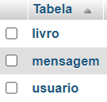
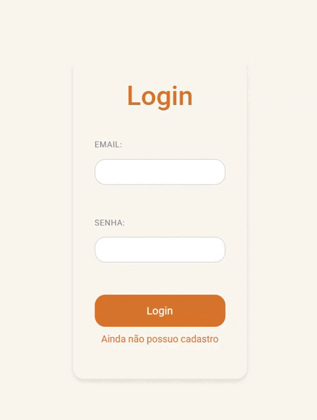
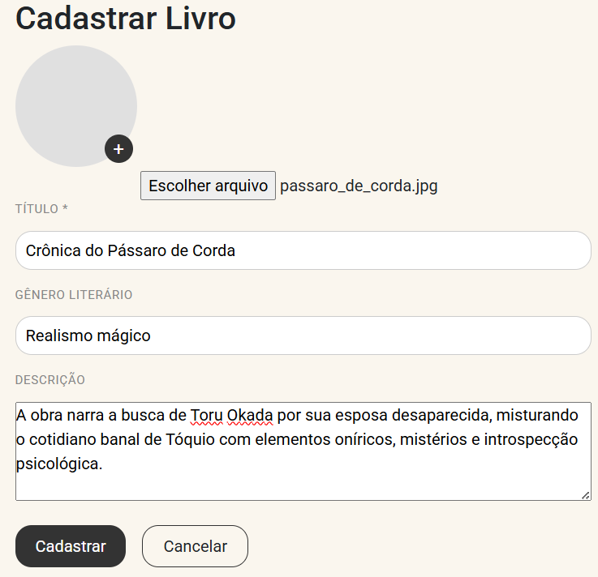
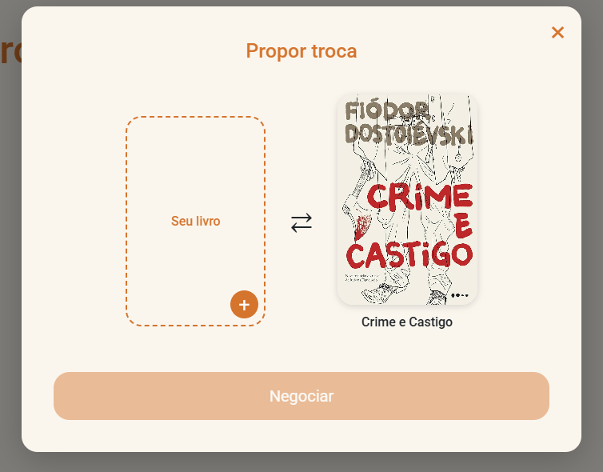
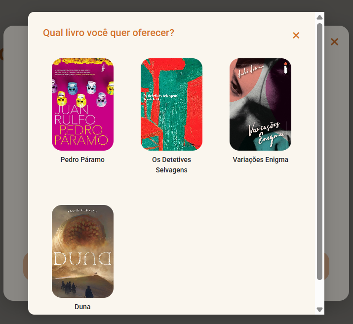
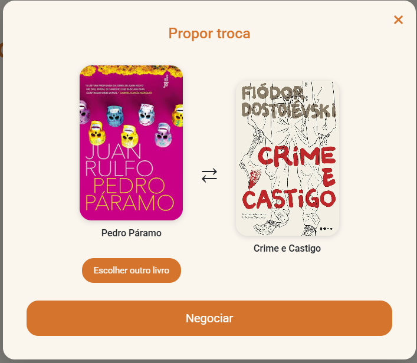
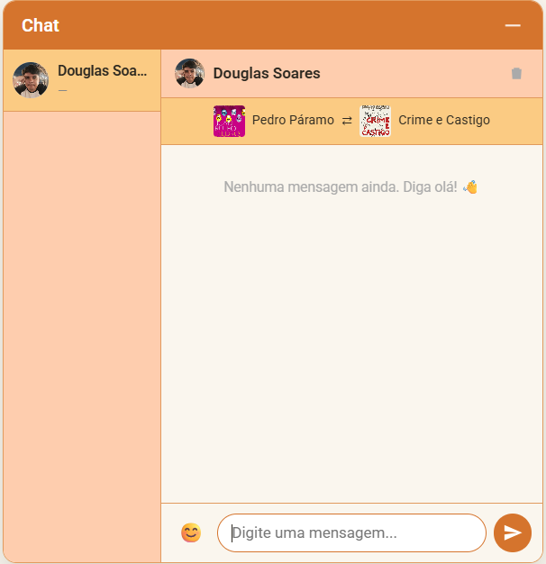

# 📚 Já Leu Esse?

Plataforma de **troca de livros entre usuários**, desenvolvida como projeto acadêmico no curso de Desenvolvimento de Software Multiplataforma. O sistema permite que leitores cadastrem seus livros, naveguem pelo acervo de outros usuários, proponham trocas e negociem via chat em tempo real.

---

## 🗂️ Estrutura do Projeto

```
ja-leu-esse/
├── api/
│   ├── crud.php                    # API REST genérica (GET, POST, PUT, DELETE)
│   └── mensagens.php               # API dedicada ao chat
├── assets/
│   ├── img/
│   │   ├── users_profile_images/   # gerada automaticamente no primeiro upload
│   │   └── user{id}_books_images/  # geradas automaticamente por usuário
├── css/
│   ├── chat.css
│   ├── global.css                  # CSS de elementos padrõs ou comuns em todas as páginas
│   ├── home.css
│   ├── layouts.css
│   ├── login.css
│   ├── media-query.css             # CSS responsável pela responsividade
│   ├── perfil.css
│   ├── root.css                    # variáveis CSS usadas em todas as páginas
│   ├── style.css                   # arquivo que importa todos os outros arquivos CSS
│   ├── trocas.css
├── js/
│   ├── Chat.js                     
│   ├── Endereco.js                 
│   ├── FormDinamico.js             
│   ├── script.js                   # script main, importa todos os outros
│   ├── TrocaFotos.js
│   ├── Trocas.js
│   ├── ValidadorForm.js            # validação client-side nos formulários                
├── php/
│   ├── components/
│   │   └── chat.php                # componente de chat (incluído no footer)
│   ├── config/
│   │   └── env_example.php         # ← renomear para env.php antes de rodar
│   ├── layouts/
│   │   ├── header.php
│   │   └── footer.php
│   ├── pages/
│   │   ├── home.php
│   │   ├── login.php               # pode logar ou cadastrar dependendo da ação do usuário
│   │   ├── perfil.php
│   │   ├── perfil_edicao.php
│   │   ├── livro_cadastro.php
│   │   ├── livro_cadastro_edicao.php
│   │   └── trocas.php
│   ├── partials/
│   │   ├── head.php                # importa todo o CSS e define favicon
│   └── scripts/
│       ├── functions.php           # funções gerais usadas nas páginas
│       ├── atributos.php
│       ├── stock_photo.php         # script que recebe os livros cadastrados
│       ├── logout.php
│       └── delete_livro.php
├── sql/
│   └── db_jle.sql                  # script de criação e população do banco
└── index.php                       # redireciona para a página inicial (php/pages/home.php)
```

---

## ⚙️ Como rodar localmente

### Pré-requisitos

- [XAMPP](https://www.apachefriends.org/) (ou servidor equivalente com Apache + PHP 8.1+ + MySQL)
- Navegador moderno (Chrome, Firefox, Edge)

---

### 1. Posicionamento obrigatório do projeto

> ⚠️ **Esse passo é essencial para a API funcionar.**

O projeto deve estar dentro de uma pasta chamada `sistema`, localizada no `htdocs` do XAMPP (ou equivalente do seu servidor). A estrutura de pastas deve ser:

```
xampp/
└── htdocs/
    └── sistema/
        └── ja-leu-esse/
```

O acesso pelo browser deve ser exatamente:
```
http://localhost/sistema/ja-leu-esse/
```

Qualquer outro caminho fará a API retornar erros de URL inválida.

---

### 2. Banco de dados

1. Abra o **phpMyAdmin** (`http://localhost/phpmyadmin`)
2. Crie um banco de dados chamado exatamente **`db_jle`**
3. Selecione o banco recém-criado
4. Vá em **Importar** e selecione o arquivo `sql/db_jle.sql`
5. Clique em **Executar**

O script cria todas as tabelas necessárias sem população. Cadastre usuários para testar o funcionamento.



---

### 3. Configurar o ambiente

Dentro da pasta `php/config/`, existe um arquivo chamado **`env_example.php`**.

Renomeie-o para **`env.php`**:

```
php/config/env_example.php  →  php/config/env.php
```

O conteúdo padrão já está configurado para o ambiente local:

```php
$DATABASE = [
    'host'     => 'localhost',
    'dbname'   => 'db_jle',
    'username' => 'root',
    'password' => '',          // senha padrão do XAMPP
];

$API_CRUD = [
    'url' => 'http://localhost/sistema/ja-leu-esse/api/crud.php',
];

$API_CHAT = [
    'url' => 'http://localhost/sistema/ja-leu-esse/api/mensagens.php',
];
```

Se o seu MySQL tiver senha ou usuário diferente, ajuste os campos `username` e `password`.

---

### 4. Iniciar o servidor

No painel do XAMPP, inicie os módulos **Apache** e **MySQL**. Depois acesse:

```
http://localhost/sistema/ja-leu-esse/
```

---

## 🔑 Nota sobre a API

As APIs (`crud.php` e `mensagens.php`) são **versões de teste**, expostas para facilitar o desenvolvimento e avaliação local. Elas apontam para o banco de dados local configurado no `env.php`.

Em produção, esses arquivos serão substituídos por versões que apontam para um banco de dados online. O `env.php` de produção armazenará as URLs das APIs remotas — sem expor credenciais ou lógica de acesso. Por isso o arquivo de configuração local se chama `env_example.php` e está incluído no repositório apenas como referência.

---

## 🖼️ Armazenamento de imagens

Como a versão de teste opera localmente, as imagens são salvas diretamente no servidor:

| Tipo | Caminho gerado |
|---|---|
| Foto de perfil | `assets/img/users_profile_images/{id_usuario}/photo.{ext}` |
| Capa de livro | `assets/img/user{id_usuario}_books_images/{id_livro}.{ext}` |

Essas pastas são criadas automaticamente quando o usuário faz o primeiro upload. Formatos aceitos: `jpg`, `jpeg`, `png`, `webp`.

---

## 🚀 Funcionalidades

### Autenticação — Formulário dinâmico

A página de login (`/php/pages/login.php`) apresenta um **formulário dinâmico** que alterna entre dois modos sem recarregar a página:

- **Login** — o usuário informa e-mail e senha para acessar sua conta
- **Cadastro** — formulário completo com nome, e-mail, senha, telefone, gênero, endereço e gênero literário favorito. O CEP é preenchido automaticamente via API do ViaCEP ao ser digitado.

A troca entre os modos é feita pelos links *"Ainda não possuo cadastro"* e *"Já possuo cadastro"*, controlados pela classe `FormDinamico` em JavaScript.

Regras de negócio aplicadas no cadastro:
- E-mail e telefone únicos (verificados antes de inserir no banco)
- Confirmação de senha validada no cliente e no servidor



---

### Perfil do usuário

Após o login, o usuário acessa seu perfil em `/php/pages/perfil.php`, onde visualiza:

- Foto de perfil (silhueta padrão caso não tenha cadastrado)
- Dados pessoais: nome, e-mail, telefone, gênero, endereço, gênero literário favorito
- Lista de livros cadastrados com opções de **editar** e **deletar** ao clicar

#### Editando o perfil e adicionando foto

1. Clique em **"Editar perfil"**
2. Na página de edição, clique na foto (silhueta) para abrir o seletor de arquivo
3. Escolha uma imagem — o preview aparece imediatamente sem precisar salvar
4. Altere os campos desejados e clique em **"Salvar"**

A foto é substituída a cada upload (sem acumular arquivos antigos no servidor).


#### Cadastrando um livro

1. Na página de perfil, clique em **"Cadastrar um Livro"**
2. Adicione a capa do livro clicando no ícone
3. Preencha título (obrigatório), gênero literário e descrição
4. Clique em **"Cadastrar"**
- **DICA**: na pasta `assets/img/examples` há capas de alguns livros para facilitar os testes



O livro aparecerá na lista do perfil e ficará disponível na página de Trocas para outros usuários.

Para editar ou remover um livro já cadastrado, clique sobre ele na lista do perfil — um menu com as opções **Editar** e **Deletar** aparecerá.


#### Deletando a conta

Na página de perfil, o botão **"Deletar conta"** leva a uma página de confirmação. A exclusão é irreversível e remove todos os dados do usuário do banco.

---

### Página de Trocas

A página `/php/pages/trocas.php` exibe todos os livros cadastrados por **outros usuários** (os próprios livros do usuário logado não aparecem aqui).


#### Fluxo de proposta de troca

```
Usuário clica em um livro
         ↓
Modal abre mostrando o livro desejado (slot direito)
         ↓
```



```
Usuário clica em "+" para selecionar o livro que quer oferecer
         ↓
Seletor exibe apenas os livros do próprio usuário
         ↓
```



```
Usuário seleciona seu livro (slot esquerdo preenchido)
         ↓
Botão "Negociar" é habilitado
         ↓
```



```
Chat abre com o dono do livro desejado
e exibe uma barra fixa mostrando os dois livros da proposta
```



A barra de contexto com os dois livros é salva no banco de dados, então **ambos os usuários** a veem ao abrir o chat, mesmo que um deles não tenha estado online na hora da proposta.

---

### Chat em tempo real

O chat é um componente fixo disponível em **todas as páginas** para usuários logados, acessível pelo botão flutuante no canto inferior direito.

#### Funcionalidades do chat

| Funcionalidade | Descrição |
|---|---|
| Lista de conversas | Painel esquerdo com todos os contatos, mostrando a última mensagem de cada conversa |
| Mensagens em tempo real | Atualização automática a cada 3 segundos via polling |
| Emojis | Botão 😊 abre um seletor com 30 emojis |
| Enter para enviar | Pressionar Enter envia a mensagem; Shift+Enter quebra linha |
| Notificação | Badge **!** vermelho aparece no botão do chat quando há mensagens não lidas |
| Marcar como lido | Mensagens são marcadas automaticamente ao abrir a conversa |
| Deletar conversa | Ícone de lixeira no header da conversa apaga todas as mensagens dos dois lados |
| Contexto de troca | Barra fixa exibindo os livros da proposta, visível para os dois usuários |
| Minimizar | Botão **─** fecha o painel sem sair da página |

O badge de notificação é verificado a cada 5 segundos quando o chat está fechado e desaparece ao abrir o painel.


---

## 🛠️ Tecnologias utilizadas

| Camada | Tecnologia |
|---|---|
| Frontend | HTML5, CSS3, JavaScript (ES Modules) |
| Backend | PHP 8.2 |
| Banco de dados | MySQL via PDO |
| Servidor local | XAMPP (Apache + MySQL) |
| CEP | API ViaCEP |
| Ícones/SVG | SVGs inline |

---

## 👥 Observações finais

- O projeto **não usa frameworks** de frontend (sem Bootstrap, sem React) — toda a estilização e comportamento são escritos do zero
- A comunicação com o banco é feita exclusivamente via API REST (nunca diretamente das páginas PHP)
- O JavaScript é organizado em **classes ES6** (`FormDinamico`, `ValidadorForm`, `Endereco`, `Trocas`, `TrocaFotos`, `Chat`), importadas por um único ponto de entrada (`script.js`)
- Senhas são armazenadas com hash **BCrypt** via `password_hash()` do PHP
- Todas as queries usam **prepared statements** com PDO para prevenção de SQL Injection
- Dados exibidos no HTML passam por `htmlspecialchars()` (PHP) ou `escapeHtml()` (JavaScript) para prevenção de XSS